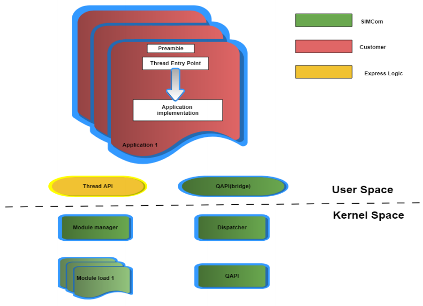
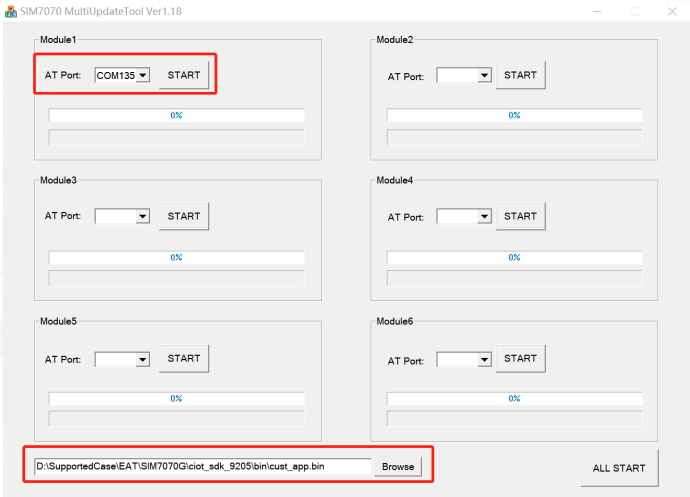

# SIM70X0 (MDM9205) DAM SDK

Downloadable Application Module (DAM) SDK for SIMCom SIM7070/SIM7080/SIM7090 series modules based on Qualcomm MDM9205 chipset.



**DAM** allows you to develop and run C applications directly on the module, eliminating the need for an external MCU in many IoT scenarios.

## Features

- **C-based Development** — Write applications in C and run directly on ARM Cortex-A7 (up to 1.3 GHz, 256 KB L2 cache)
- **Multi-threading** — ThreadX RTOS with full multi-thread support
- **Rich Peripherals** — GPIO, I2C, SPI, ADC, UART, USB and more via QAPI
- **AT Command Integration** — Send/receive AT commands from within your application
- **Generous Resources** — Up to 3 MB DDR, 500 KB code flash, ~5 MB EFS storage
- **FW Independent** — Applications run across firmware updates without recompilation
- **Low Power** — Automatic sleep mode when idle; interrupt-driven wake-up
- **Extensible** — Build your own libraries (e.g. SQLite, zip) on top of the SDK

## Supported Modules

| Module      | Chipset  | Notes                        |
|-------------|----------|------------------------------|
| SIM7070G    | MDM9205  | Global band, Cat-M1/NB-IoT/GSM  |
| SIM7070E    | MDM9205  | EMEA band, Cat-M1/NB-IoT/GSM    |
| SIM7080G    | MDM9205  | Global band, Cat-M1/NB-IoT    |
| SIM7090G    | MDM9205  | Global band, Cat-M1/NB-IoT  |

## Repository Structure

```
ciot_sdk_9205/
├── build_llvm_mk.bat       # Windows compile script
├── build_llvm_mk.sh        # Linux compile script
├── Makefile
├── include/                # Header files (QAPI, QMI, ThreadX)
│   ├── qapi/
│   ├── qmi/
│   └── threadx_api/
├── libs/                   # Prebuilt library files
│   ├── diag_dam_lib.lib
│   ├── IDL_DAM_LIB.lib
│   ├── qapi_psm_lib.lib
│   ├── qcci_dam_lib.lib
│   ├── timer_dam_lib.lib
│   └── txm_lib.lib
├── src/
│   └── app/
│       ├── application/    # Main application entry point
│       ├── demo/           # Demo examples
│       ├── asm/            # Assembly preamble
│       ├── Easylogger/     # Logging library
│       └── cust.mak        # Custom makefile for adding source paths
└── tools/                  # Build toolchain configuration
    └── opt.mak
```

## Prerequisites

| Tool                              | Version   |
|-----------------------------------|-----------|
| Snapdragon LLVM                   | 4.0.11    |
| Python                            | 2.7.15    |
| OS                                | Windows 10(recommended) |

## Quick Start

### 1. Install Toolchain

1. Download and Extract [Snapdragon-llvm-4.0.11-windows64](https://1drv.ms/u/c/1964fa2b798f638e/IQBK6nxb7C61R4XPjGtF_NjVAbkUeKALuhHMos2Y23_Bzps?e=pQS9IJ) to your workspace (e.g. `D:\SupportedCase\EAT\SIM7070G\`)
2. Install [Python 2.7.15](https://1drv.ms/u/c/1964fa2b798f638e/IQCOY495K_pkIIAZlwIAAAAAAaKWH8z9mLaSSl_EVtiAaJk?e=XIRTay) (default path `C:\Python27`)

### 2. Configure Build Paths

Edit `ciot_sdk_9205/tools/opt.mak` and update the LLVM and Python paths:

```makefile
ifeq ($(OS), WINDOWS)
LLVMTOOLCHAIN_PATH := D:\your\path\Snapdragon-llvm-4.0.11-windows64\bin
LLVMTOOLCHAIN_PATH_STANDARDS := D:\your\path\Snapdragon-llvm-4.0.11-windows64\armv7m-none-eabi\libc\include
LLVMLIB := D:\your\path\Snapdragon-llvm-4.0.11-windows64\lib\clang\4.0.11\lib
LLVMLINK_PATH := D:\your\path\Snapdragon-llvm-4.0.11-windows64\tools\bin
LLVMTOOLCHAIN := clang.exe
LLVMLINKTOOL := clang++.exe
PYTHON_PATH := c:/Python27/python.exe
```

### 3. Build

```bash
# Windows
build_llvm_mk.bat

# Linux(Contact SIMCom FAE for Linux support)
./build_llvm_mk.sh
```
>[!NOTE]
>Note: If there is any error,please refer to build.log for bug fix.

The compiled binary will be generated at `ciot_sdk_9205/bin/cust_app.bin`.

### 4. Download to Module

1. Download and open [SIM7070 MultiUpdateTool](c:\Users\yanan.sun\Desktop\SIMCom\SIMCom_EAT\SIM7070\Snapdragon-llvm-4.0.11-windows64.zip)
2. Select the AT port (UART or USB)
3. Browse and select `cust_app.bin`
4. Power on the module and click **Start**
5. The application will auto-run after reboot

## Development

### Entry Point

The DAM application entry is `qcli_dam_app_start` located in:

```
src/app/application/pal_module.c
```

Create your own tasks and application logic from this entry point.

### APIs

- **ThreadX** — Thread creation and management. See `include/threadx_api/` and [SIM70X0 Series_ThreadX_API_V1.00](doc/SIM70X0%20Series_ThreadX_API_V1.00.pdf)
- **QAPI** — Hardware and software peripheral access (UART, SPI, ADC, AT, Timer, I2C, USB, etc.). See `include/qapi/` and [SIM70X0 Series_QAPI_V1.00](doc/SIM70X0%20Series_QAPI_V1.00.pdf)

### AT Commands from DAM

| External MCU Approach              | DAM Approach                              |
|------------------------------------|-------------------------------------------|
| MCU sends AT via UART              | App calls `IOT_Visual_AT_Input()`         |
| MCU receives response via UART     | App reads via `IOT_Visual_AT_Output()`    |

### Adding Source Files

To add new source directories, edit `src/app/cust.mak`:

```makefile
CUST_SRC_PATH += ./src/app/atfwd \
                 ./src/app/location \
                 ./src/app/net \
                 ./src/app/qcli \
                 ./src/app/simcom \
                 ./src/your_new_folder
```

### Modem Operations (TCP/UDP/MQTT/SSL/HTTP/FTP)

For modem-related operations, use **AT commands** (refer to the relevant application notes) rather than QAPI directly.

## Erasing the Application

To erase a DAM application from the module:

1. Use **QFIL** tool from QPST package
2. Check **"Erase All Before Download"**
3. Flash firmware and `.mbn` file

Contact your SIMCom FAE for QPST tool access and support.

## Hardware Peripherals

### SIM7070G / SIM7070E

| Pin Name    | Pin No. | Mode 1  | Mode 2      | Mode 3      | Mode 4 | Interrupt | Remark                 |
|-------------|---------|---------|-------------|-------------|--------|-----------|------------------------|
| UART_RI     | 4       | GPIO26  | -           | -           | -      | Y         |                        |
| UART_DCD    | 5       | GPIO28  | -           | -           | -      | Y         |                        |
| PCM_CLK     | 11      | GPIO24  | -           | -           | -      | N         |                        |
| PCM_SYNC    | 12      | GPIO21  | -           | -           | -      | Y         |                        |
| PCM_DIN     | 13      | GPIO22  | -           | -           | -      | Y         |                        |
| PCM_DOUT    | 14      | GPIO23  | -           | -           | -      | N         |                        |
| GPIO1       | 19      | GPIO4   | SPI2_MOSI   | UART2_TX    | -      | Y         | boot_config[3]         |
| GPIO2       | 20      | GPIO5   | SPI2_MISO   | UART2_RX    | -      | Y         |                        |
| GPIO3       | 21      | GPIO7   | SPI2_CLK    | UART2_RTS   | I2C2_SCL | N       |                        |
| UART_RXD1   | 22      | GPIO1   | UART1_RX    | SPI1_MISO   | -      | Y         | QAPI_UART_PORT_001_E   |
| UART_TXD1   | 23      | GPIO0   | UART1_TX    | SPI1_MOSI   | -      | Y         | QAPI_UART_PORT_001_E   |
| ADC         | 25      | ADC     | -           | -           | -      | N         |                        |
| I2C_SDA     | 37      | GPIO2   | UART1_CTS   | I2C1_SDA    | SPI1_CS     | Y         |                            |
| I2C_SCL     | 38      | GPIO3   | UART1_RTS   | I2C1_SCL    | SPI1_CLK    | N         |                            |
| GPIO4       | 48      | GPIO6   | SPI2_CS     | UART2_CTS   | I2C2_SDA    | Y         |                            |
| UART_RXD3   | 49      | GPIO9   | SPI3_MISO   | UART3_RX    | -           | Y         | QAPI_UART_PORT_002_E        |
| UART_TXD3   | 50      | GPIO8   | SPI3_MOSI   | UART3_TX    | -           | Y         | QAPI_UART_PORT_002_E        |
| NETLIGHT    | 52      | GPIO11  | SPI3_CLK    | I2C3_SCL    | UART3_RTS   | N         |                            |
| STATUS      | 66      | GPIO10  | SPI3_CS     | I2C3_SDA    | UART3_CTS   | N         |                            |
| GPIO5       | 67      | GPIO30  | -           | -           | -           | Y         |                            |
| GPIO6       | 68      | GPIO52  | -           | -           | -           | Y         |                            |

### SIM7080G

| Pin Name     | Pin No. | Mode 1  | Mode 2      | Mode 3      | Mode 4      | Interrupt | Remark                   |
|--------------|---------|---------|-------------|-------------|------------|-----------|--------------------------|
| SPI_CS       | 48      | GPIO6   | SPI2_CS     | UART2_CTS   | I2C2_SDA   | Y         |                          |
| SPI_MOSI     | 49      | GPIO4   | SPI2_MOSI   | UART2_TX    | -          | Y         | boot_config[3]           |
| SPI_CLK      | 50      | GPIO7   | SPI2_CLK    | UART2_RTS   | I2C2_SCL   | N         |                          |
| SPI_MISO     | 51      | GPIO5   | SPI2_MISO   | UART2_RX    | -          | Y         |                          |
| GPIO1        | 57      | GPIO50  | -           | -           | -          | Y         |                          |
| GPIO2        | 58      | GPIO30  | -           | -           | -          | Y         |                          |
| GPIO3        | 59      | GPIO25  | -           | -           | -          | N         |                          |
| GPIO4        | 60      | GPIO52  | -           | -           | -          | Y         |                          |
| UART_TXD3    | 61      | GPIO8   | SPI3_MOSI   | UART3_TX    | -          | Y         | QAPI_UART_PORT_002_E     |
| UART_RXD3    | 62      | GPIO9   | SPI3_MISO   | UART3_RX    | -          | Y         | QAPI_UART_PORT_002_E     |
| I2C_SDA      | 64      | GPIO2   | UART1_CTS   | I2C1_SDA    | SPI1_CS    | Y         |                          |
| I2C_SCL      | 65      | GPIO3   | UART1_RTS   | I2C1_SCL    | SPI1_CLK   | N         |                          |
### SIM7090G

| Pin Name     | Pin No. | Mode 1  | Mode 2      | Mode 3      | Mode 4      | Interrupt | Remark                   |
|--------------|---------|---------|-------------|-------------|-------------|-----------|--------------------------|
| GPIO1        | 1       | GPIO50  | -           | -           | -           | Y         |                          |
| PCM_DIN      | 2       | GPIO22  | -           | -           | -           | Y         |                          |
| PCM_CLK      | 3       | GPIO24  | -           | -           | -           | N         |                          |
| UART_RXD3    | 4       | GPIO9   | SPI3_MISO   | UART3_RX    | -           | Y         | QAPI_UART_PORT_002_E     |
| I2C_SDA      | 5       | GPIO2   | UART1_CTS   | I2C1_SDA    | SPI1_CS     | Y         |                          |
| SPI_MISO     | 8       | GPIO5   | SPI2_MISO   | UART2_RX    | -           | Y         |                          |
| SPI_CLK      | 9       | GPIO7   | SPI2_CLK    | UART2_RTS   | I2C2_SCL    | N         |                          |
| ADC0         | 17      | ADC     | -           | -           | -           | -         |                          |
| ADC1         | 18      | ADC     | -           | -           | -           | -         |                          |
| PCM_DOUT     | 34      | GPIO23  | -           | -           | -           | N         |                          |
| PCM_SYNC     | 35      | GPIO21  | -           | -           | -           | Y         |                          |
| UART_TXD3    | 36      | GPIO8   | SPI3_MOSI   | UART3_TX    | -           | Y         | QAPI_UART_PORT_002_E     |
| I2C_SCL      | 37      | GPIO3   | UART1_RTS   | I2C1_SCL    | SPI1_CLK    | N         |                          |
| SPI_MOSI     | 40      | GPIO4   | SPI2_MOSI   | UART2_TX    | -           | Y         | boot_config[3]           |
## Resources

- [SIMCom M2M Official Website](http://www.simcom.com)
- ThreadX API Reference: `SIM70X0 Series_ThreadX_API_V1.00`
- QAPI Reference: `SIM70X0 Series_QAPI_V1.00`

## Support

For technical support, contact your SIMCom FAE or reach out via:

- **Email:** support@simcom.com
- **Tel:** +86 21 31575100 / +86 21 31575200
- **Address:** SIMCom Headquarters Building, Building 3, No. 289 Linhong Road, Changning District, Shanghai P.R. China 200335

---

*SIMCom Wireless Solutions Co., Ltd. &copy; 2026 All rights reserved*
